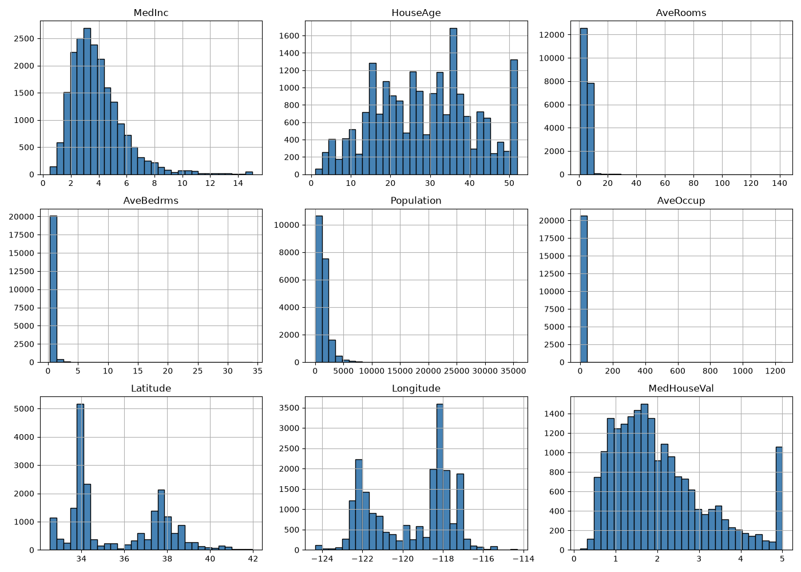
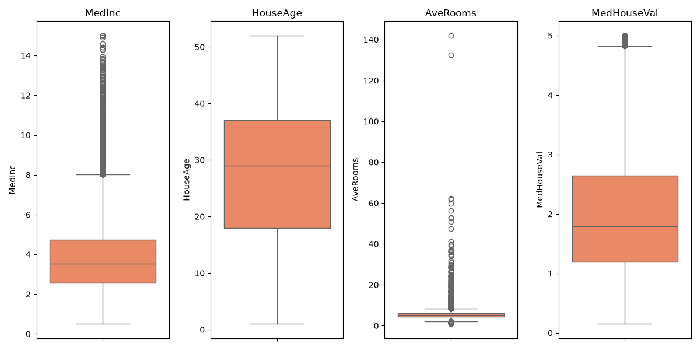
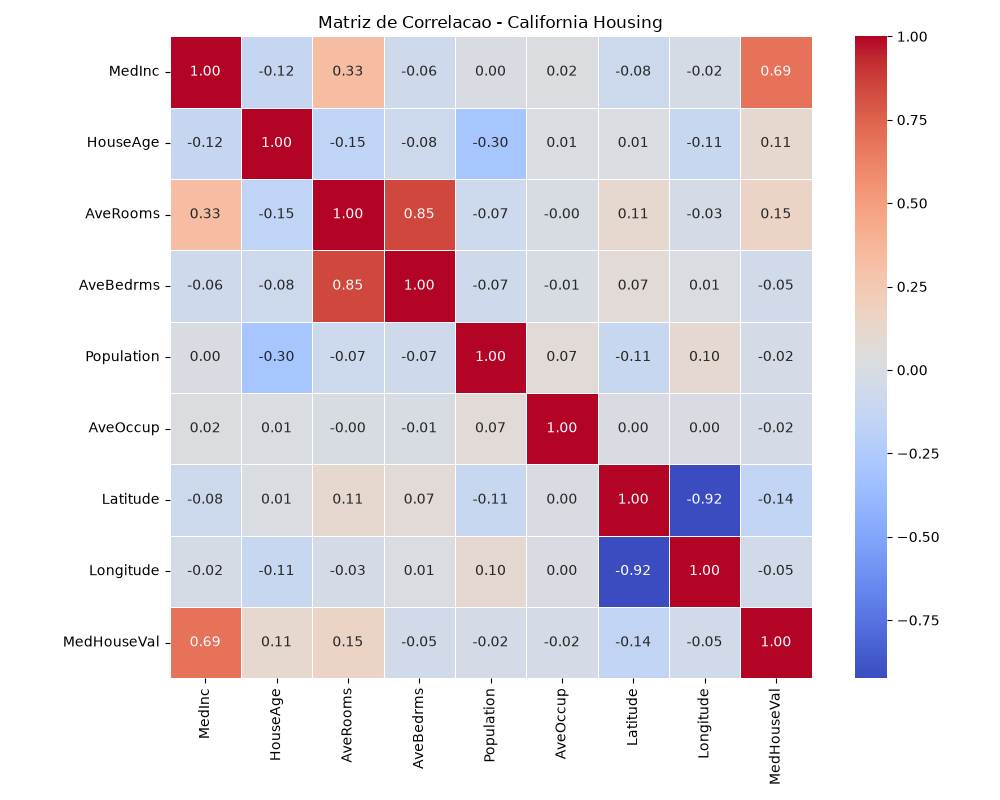
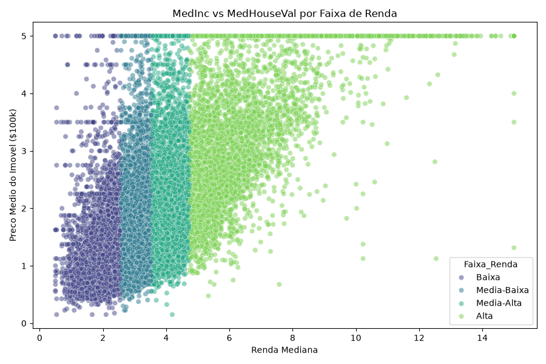
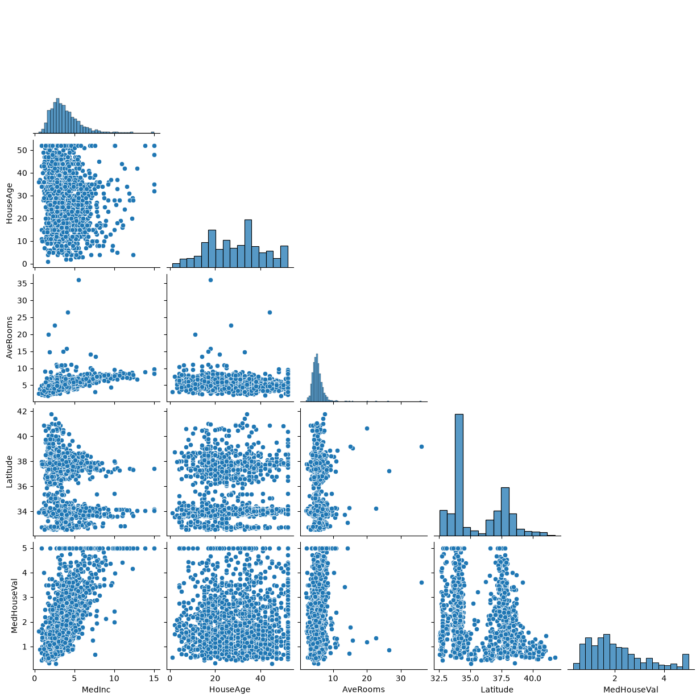

# Atividade 01 - Analise Exploratoria e Pre-processamento (California Housing)

Trabalho pratico da disciplina de Laboratorio de Inovacao Social focado no tratamento de dados e analise exploratoria do dataset California Housing.

Aluno: Marcus David Nascimento de Sa  
Matricula: 2056506  

---

### O que foi feito na atividade

- Inspecao inicial da estrutura e tipos dos dados
- Simulacao de dados faltantes e teste de imputacao por media e mediana
- Normalizacao (MinMaxScaler) e padronizacao (StandardScaler) com divisao 80/20 (fit apenas no treino para evitar vazamento)
- Analise de distribuicao e outliers com histogramas e boxplots
- Matriz de correlacao das variaveis com o alvo (MedHouseVal)
- Scatter plot por faixa de renda e pairplot multivariado
- Levantamento de insights para futuras etapas de modelagem

---

### Graficos gerados

**Histogramas das variaveis:**


**Boxplots (Outliers):**


**Heatmap de Correlacao:**


**Renda vs Valor do Imovel:**


**Pairplot:**


---

### Como rodar o projeto

Clone o repositorio:
```bash
git clone [https://github.com/Md-sa0/laboratorio-inovacao-social.git](https://github.com/Md-sa0/laboratorio-inovacao-social.git)
cd laboratorio-inovacao-social